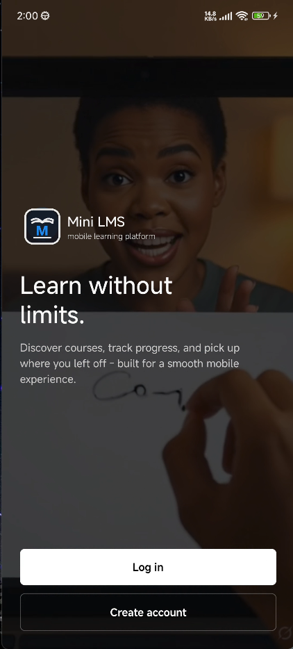
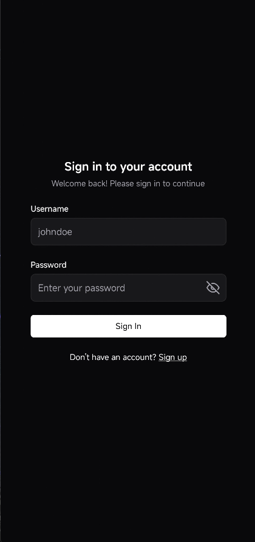
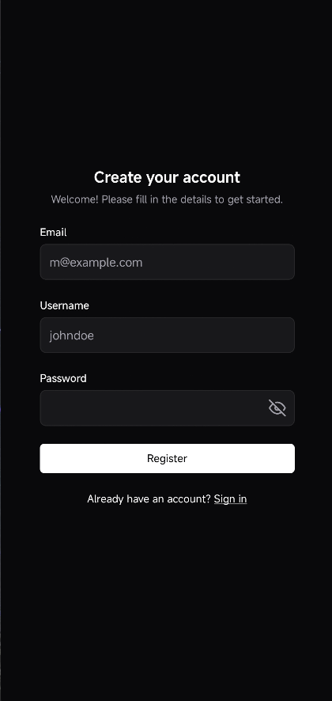
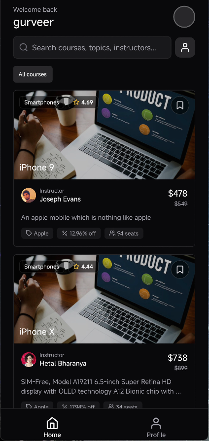
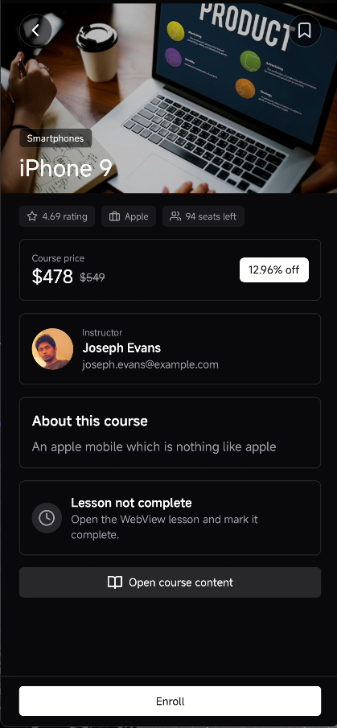
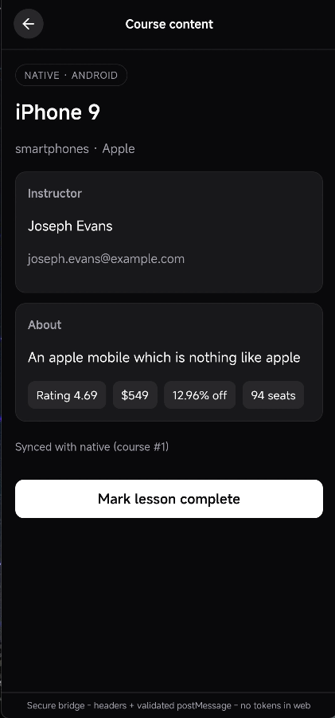
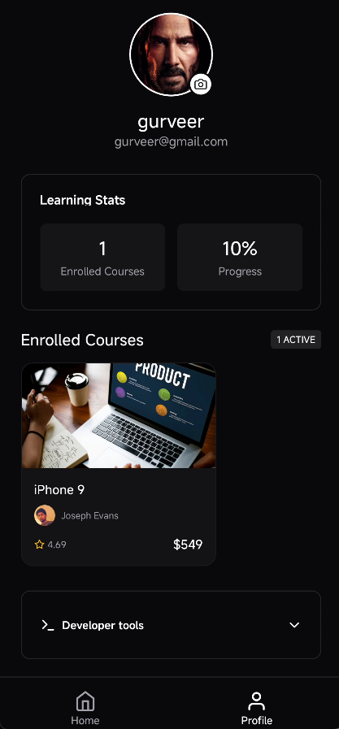
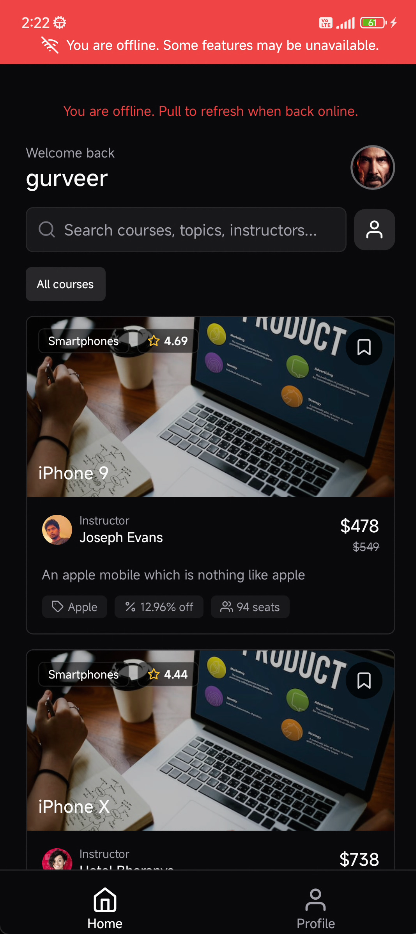

# Mini LMS

Mini LMS is a React Native Expo assignment project that demonstrates authentication, native course browsing, WebView integration, notifications, persistent state, and offline/error handling using the FreeAPI public endpoints.

## Submission Summary

- Framework: React Native Expo SDK 55
- Language: TypeScript with `strict: true`
- Navigation: Expo Router
- Styling: NativeWind
- Sensitive storage: Expo SecureStore
- App storage: AsyncStorage
- List optimization: `@legendapp/list`

## Setup

Requirements:

- Node.js 20 or newer
- npm
- Android Studio for Android builds, emulator usage, or device deployment
- Expo CLI through `npx`

Install dependencies:

```bash
npm install
```

Create `.env` in the project root:

```env
EXPO_PUBLIC_API_URL=https://api.freeapi.app/api/v1
```

Run the project:

```bash
npx expo start
```

Useful commands:

```bash
npm run android
npm run web
npm run lint
npx expo start -c
```

## Demo Video

Demo video: [https://drive.google.com/file/d/1Db54idJbtXDuVhRvEYrOQbE3YjWyETuF/view?usp=sharing]()

The demo video walks through the main app flow: welcome screen, registration, login, course catalog, search/bookmarks, course details, enrollment, WebView course content, profile and logout.

## Features Implemented

- User registration and login with FreeAPI user endpoints
- Secure token storage and automatic session restoration on app restart
- Token refresh flow with Axios interceptors and guarded retry logic
- Profile screen with user info, local avatar picker, and learning stats
- Native course catalog built from FreeAPI `randomproducts` and `randomusers`
- Search, bookmarking, pagination, pull-to-refresh, and local persistence
- Course details with enroll state, bookmark toggle, and progress feedback
- WebView lesson screen with bundled local HTML
- Native-to-web data bridge using custom headers and injected metadata
- Web-to-native communication using validated `postMessage` events
- Local notifications for milestone bookmarks and 24-hour return reminders
- Offline banner, API retry handling, timeout handling, and empty/error states

## Screenshots

















## Architectural Decisions

- Expo Router is used for route-based navigation and auth-gated app sections.
- Zustand stores are split by feature so auth, courses, bookmarks, enrollment, and preferences stay isolated and easier to persist.
- SecureStore is used only for sensitive auth data, while AsyncStorage is used for app-level cached and user preference data.
- Public FreeAPI product and user records are mapped into a course/instructor domain model so the app behaves like an LMS instead of a generic sample-data browser.
- WebView content is bundled locally and receives only non-sensitive metadata. Authentication tokens are never injected into the web layer.
- Axios interceptors handle auth token attachment, refresh, and request retry to keep API behavior consistent across features.
- LegendList is used for the course feed to satisfy the assignment requirement and to keep scrolling performant with memoized item rendering.

## Known Limitations

- FreeAPI product images were unreliable during testing, so the app uses a stable fallback course image for a consistent visual result.
- There is no automated test suite in the current submission.
- The profile avatar update is stored locally for the app experience and is not uploaded to a backend profile endpoint.

## Documentation

Additional notes are split by topic:

- [Documentation Index](./docs/README.md)
- [Setup](./docs/setup.md)
- [Assignment Checklist](./docs/assignment-checklist.md)
- [Project Structure](./docs/project-structure.md)
- [Authentication](./docs/authentication.md)
- [Course Catalog](./docs/course-catalog.md)
- [WebView Integration](./docs/webview-integration.md)
- [Notifications](./docs/notifications.md)
- [State and Performance](./docs/state-performance.md)
- [Error Handling](./docs/error-handling.md)
