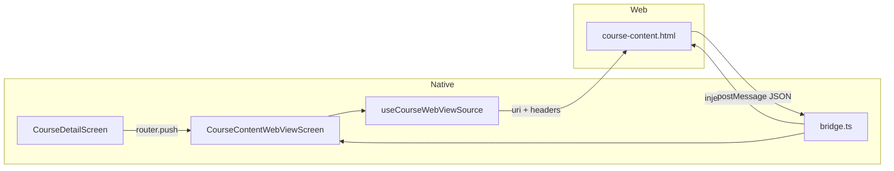

# WebView integration (HOE assignment)

This document explains how **Part 3: WebView Integration** is implemented in this project and how native ↔ web communication stays secure.

## What the assignment asked for

- A **WebView screen** showing course details
- A **local HTML template** (`assets/webview/course-content.html`)
- **Native → Web** communication using **HTTP headers**
- **Bidirectional** messaging (web can report events back to native)
- **WebView error handling** when the page fails to load

## Architecture overview



## Files to read (in order)

| File | Purpose |
|------|---------|
| `assets/webview/course-content.html` | Local UI template; reads injected context and calls `ReactNativeWebView.postMessage` |
| `src/features/courses/webview/types.ts` | Sanitized `CourseWebPayload` and message types |
| `src/features/courses/webview/bridge.ts` | Headers builder, message validation, navigation allowlist |
| `src/features/courses/webview/useCourseWebViewSource.ts` | Loads bundled HTML via `expo-asset`, attaches headers to `WebView` `source` |
| `src/features/courses/screens/CourseContentWebViewScreen.tsx` | WebView UI, errors, retries, message handler |
| `app/(main)/course/[id]/content.tsx` | Expo Router route |

**Entry point in the app:** Course detail → **“View course content (WebView)”**.

## Native → Web: headers (assignment requirement)

When the WebView loads the bundled HTML file, we pass custom headers on the `source`:

```ts
{
  uri: asset.localUri,
  headers: {
    "X-App-Id": "hoe-lms",
    "X-App-Version": "1.0.0",
    "X-Platform": "ios" | "android",
    "X-Course-Id": "123",
    "X-User-Id": "optional-user-id",
  },
}
```

Built in `buildNativeWebViewHeaders()` (`bridge.ts`).

> **Security note:** We **never** put `Authorization` / access tokens in headers or JavaScript. HTML cannot read its own HTTP request headers in the DOM, so we also inject the same metadata for the page via `injectedJavaScriptBeforeContentLoaded`:

```ts
window.__NATIVE_HEADERS__ = { ... };
window.__COURSE_PAYLOAD__ = { ...sanitized course... };
```

Only **non-sensitive** course fields are injected (title, description, instructor name/email, etc.).

## Web → Native: postMessage

The HTML sends JSON messages:

```json
{ "type": "WEBVIEW_READY", "payload": {}, "v": 1 }
```

Native parses with `parseWebToNativeMessage()`:

- Whitelist of allowed `type` values
- Version field `v` must match
- Malformed JSON is ignored

Handled events:

| Message | Native action |
|---------|----------------|
| `WEBVIEW_READY` | Hide loading overlay |
| `LESSON_COMPLETE` | Toast (validates `courseId` matches screen) |
| `REQUEST_GO_BACK` | `router.back()` |

## Security practices used

1. **Bundled HTML only** – template ships inside the app; no arbitrary remote URLs.
2. **Navigation lockdown** – `onShouldStartLoadWithRequest` + `originWhitelist` block unexpected navigations.
3. **No tokens in the WebView** – auth stays in SecureStore + Axios; web only gets public course metadata.
4. **Validated messages** – unknown types / bad JSON are dropped.
5. **Disabled risky WebView flags** – `sharedCookiesEnabled={false}`, `domStorageEnabled={false}`, no universal file access.
6. **Typed payloads** – `CourseWebPayload` strips API-only/sensitive fields before injection.

## Error handling

| Failure | UX |
|---------|-----|
| Asset/HTML missing | Inline fallback HTML + warning banner |
| `onError` / `onHttpError` | Full-screen error + **Try again** (remounts WebView via `retryKey`) |
| Course missing in store | “Course not found” with back button |

## How to test manually

1. Log in and open **Courses** → pick a course.
2. Tap **View course content (WebView)**.
3. Confirm course title, instructor, and pills render.
4. Tap **Mark lesson complete** → success toast.
5. Turn on airplane mode and reopen – bundled HTML should still load (no network required).

## Optional improvements (not required for assignment)

- Persist lesson completion in `useEnrollmentStore`
- Error boundary around WebView screen
- Unit tests for `parseWebToNativeMessage` and `isAllowedWebViewNavigation`
